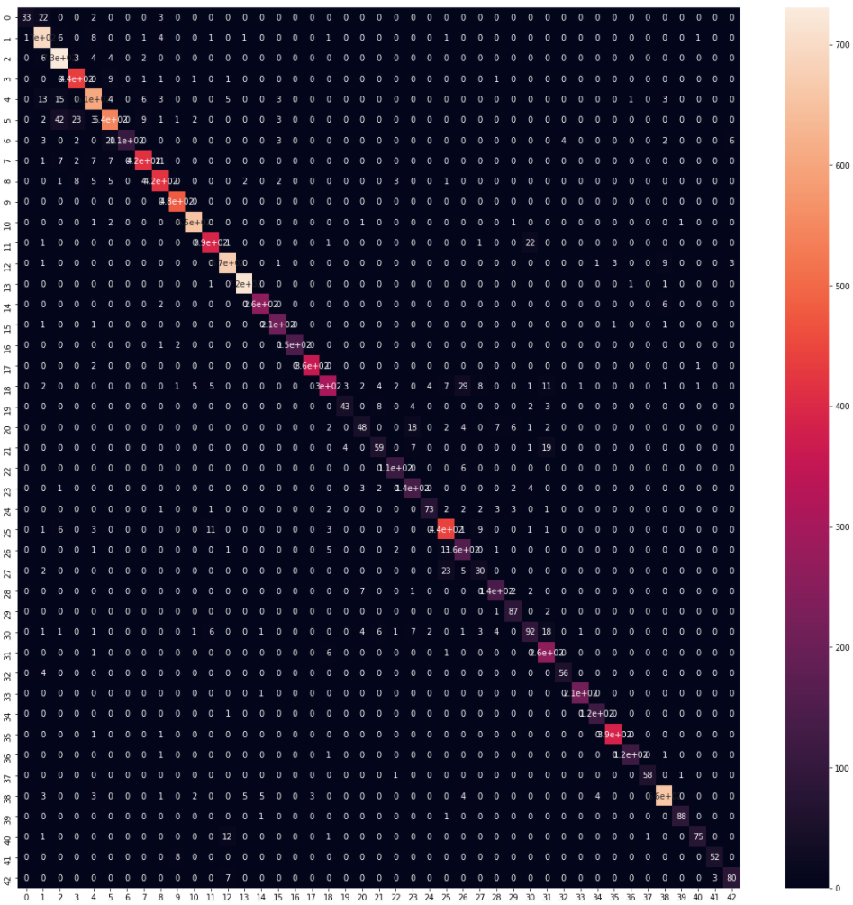
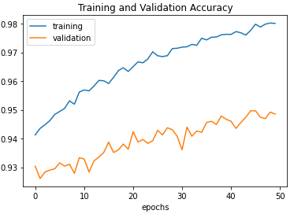
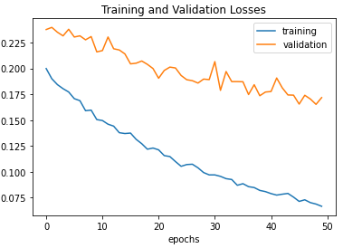

# Traffic Sign Classifier: Project Overview

- Created a traffic sign classifier using Keras

- Imported image dataset and explored the dataset

- Pre-processed images to mimprove compatibility with the model

- Built a deep convolutional neural network model using Keras 

- Tested the model and assessed its performance

## Resources

**Python Version:** 3.7

**Packages:** pandas, numpy, sklearn, matplotlib, keras, seaborn, random, cv2, pickle

**Project Adapted from:** https://www.udemy.com/course/data-science-hands-on-1-hour-project-on-deep-learning/

Project adapted from the Data Science: Hands-on 1 Hour Project on Deep Learning by School of Disruptive Innovation on Udemy. I followed the tutorial to import and pre-process the data, create the network and test it.

## EDA

I did some basic exploratory data analysis to understand the structure of the data and relationships between key variables. I indexed random images from the dataset to better understand the features of each individual image. 

## Pre-processing

I pre-processed the images for improved compatibility with the model. This consisted of three stages:

- Conversion to grayscale using cv2
- Application of histogram equalisation to standaridise lighting in all images
- Normalisation of pixel values

## Model Building

I compiled and trained a deep convolutional neural network model using Keras. I compiled the model using the 'Adam' optimiser and a learning rate of 0.0001 using a 'Sequential' approach with the following layer structure.  

- **convolutional layer**
- **pooling layer**
- **dropout layer**
- **convolutional layer**
- **pooling layer**
- **dense layer**
- **dropout layer**
- **output layer**

I then fit the model. 

## Model Performance

I created plots to show how the loss and accuracy changed over time as the model was trained and generated a confusion matrix to visualise model performance. 

The model performed very well and was able to generate predictions with an accuracy of 98%. I used the model to generate predictions for traffic signs. 
 

 
 

